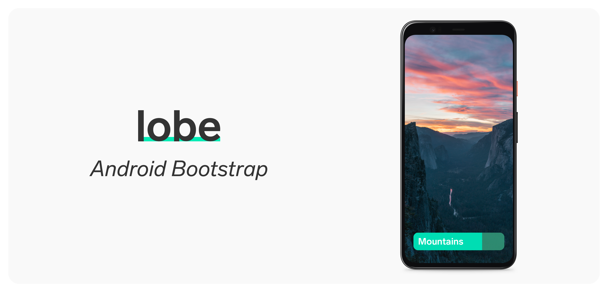

 

[Lobe](http://lobe.ai/) is a free, easy to use app that has everything you need to bring your machine learning ideas to life. The Android starter project takes the machine learning model created in Lobe, and adds it to an Android project. To get started using the starter project, follow the instructions below:

## Get Started

1. Clone, fork or download the project on your computer and install [Android Studio](https://developer.android.com/studio) to get started. Android Studio is the app that's used to run the starter project on your computer or device.

2. Open the `lobe_android` folder in this repository from inside Android Studio. Gradle will automatically start downloading the SDK's as needed.

3. Accept the required licenses by going to `SDK Manager` under the Tools menu. Click on `SDK Tools`. Then toggle `Show Package Details`. Last, install all the Android 30.0 versions under the `Android SDK Build Tools`.

4. To use your own model file, open your Lobe project, go to the Use tab, and click on the `TensorFlow Lite` model file. We recommend using the project setting `Optimize for Speed` for your model to run faster on mobile devices. You can change your project settings by going to File -> Project Settings. When exporting is done, drag both the `saved_model.tflite` and the `signature.json` files to `app/src/main/assets`.

5. Head back to Android Studio and run the app by clicking on the play button. You can also use your own Android device to run the app directly on your phone.

## Additional Information

We recommend Android Studio 4.1 or higher. This version of Android Studio will make sure your models run and load faster and more efficiently.

## Contributing

GitHub Issues are for reporting bugs, discussing features and general feedback on the Android starter project. Be sure to check our documentation, FAQ and past issues before opening any new ones.

To share your project, get feedback on it, and learn more about Lobe, please visit our community on [Reddit](https://www.reddit.com/r/Lobe/). We look forward to seeing the amazing projects that can be built, when machine learning is made accessible to you.
